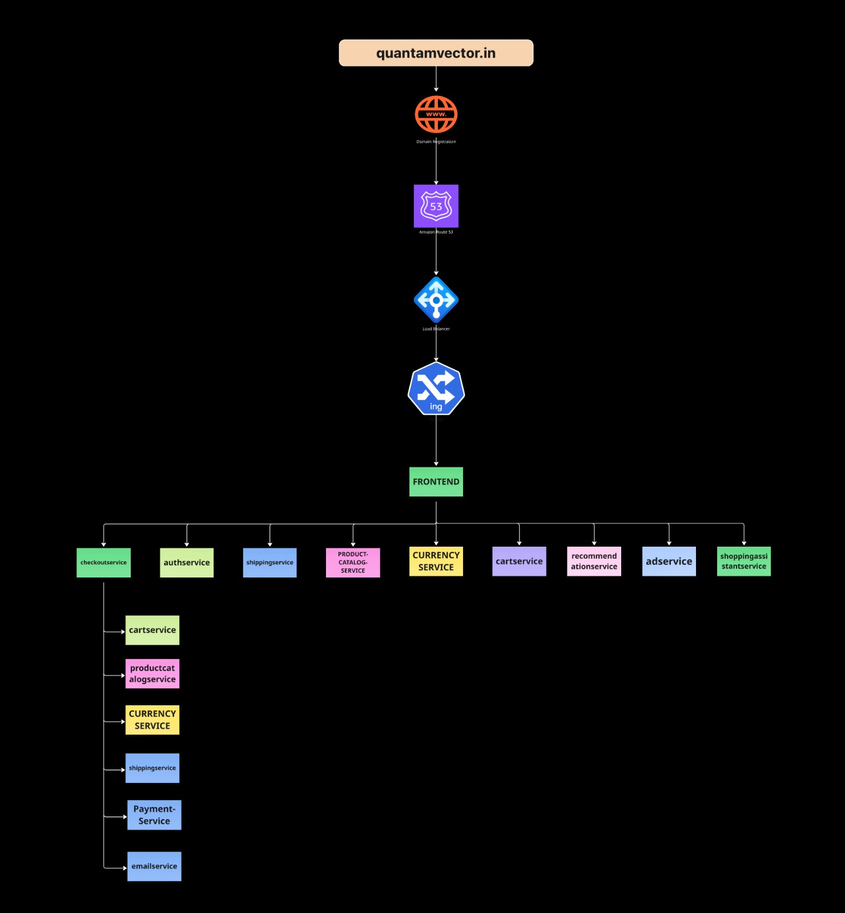
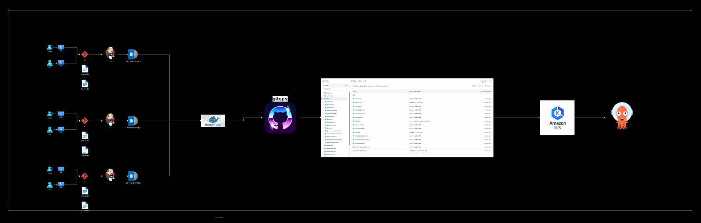
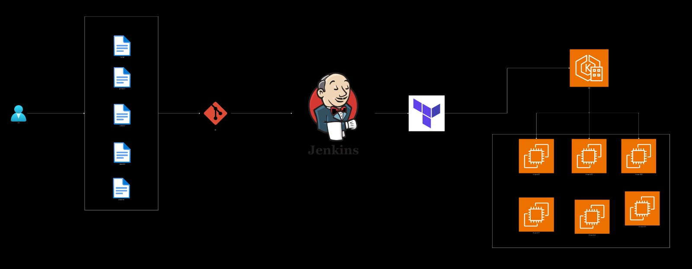
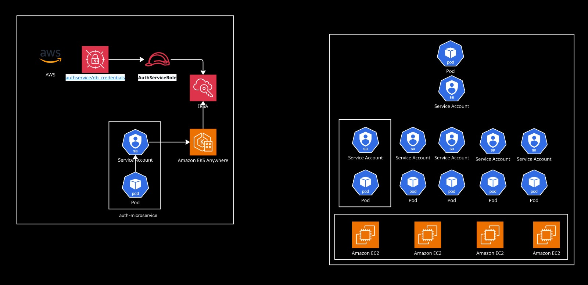
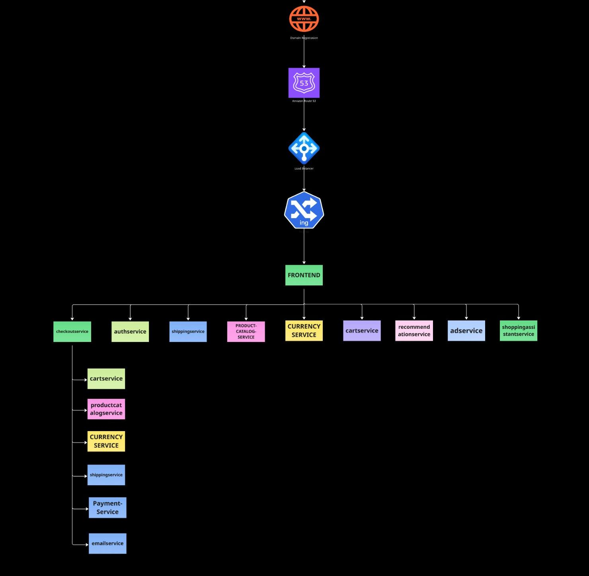

# CubeMart

CubeMart is a cloud-native e-commerce platform designed around distributed systems, platform engineering, and production-style delivery practices. The organization brings together customer-facing commerce services, operational tooling, Kubernetes deployment assets, and infrastructure-as-code to model how modern retail platforms are designed, delivered, and evolved.

## Reference Architecture
The CubeMart platform combines service development, container build pipelines, GitOps-driven deployment, and AWS-based Kubernetes runtime infrastructure into a unified operating model.

## Architecture Gallery

### CI/CD and GitOps Flow

This view highlights the repository-driven build workflow, Jenkins-based automation, Terraform provisioning, and promotion into Kubernetes runtime environments.

### Delivery Pipeline to Amazon EKS

This diagram shows the application delivery path from source control and Docker image generation through GitOps synchronization and deployment on Amazon EKS.

### Jenkins, Terraform, and Cluster Provisioning

This view focuses on infrastructure delivery, showing how Jenkins and Terraform interact with AWS-managed Kubernetes resources and worker nodes.

### Auth, IRSA, and Kubernetes Service Accounts

This diagram captures the authentication service integration pattern, including AWS Secrets Manager access, IAM roles for service accounts, and pod-level identity on EKS.

### Service Topology and Request Flow

This view outlines frontend-led request routing across the core commerce services, including catalog, cart, checkout, payment, recommendation, and assistant-oriented service flows.

## Platform Overview

CubeMart is structured as a multi-repository microservices platform with clear separation between application services, deployment configuration, and cloud infrastructure. The architecture emphasizes:

- service decomposition around business capabilities
- API-driven communication across independently deployable components
- CI/CD and GitOps-based release workflows
- Kubernetes-native deployment on Amazon EKS
- infrastructure provisioning with Terraform
- observability-oriented service design
- AI-assisted shopping and recommendation experiences

## Architecture Domains

### Experience Layer

- `frontend` serves as the user-facing storefront and primary entrypoint for web requests
- `authservice` supports identity-related flows including registration, login, and token validation

### Commerce and Transaction Layer

- `cartservice` manages per-user shopping cart state
- `checkoutservice` orchestrates order placement across downstream services
- `paymentservice` processes transaction requests
- `shippingservice` generates shipping quotes and fulfillment metadata
- `emailservice` delivers order confirmation notifications

### Catalog and Merchandising Layer

- `productcatalogservice` exposes product inventory and detail data
- `recommendationservice` generates product suggestions
- `adservice` delivers contextual promotional content
- `currencyservice` handles currency conversion for pricing workflows

### Intelligence Layer

- `shoppingassistantservice` provides AI-assisted product discovery using OpenAI, LangChain, and vector-based retrieval patterns

### Platform and Operations Layer

- `gitops` stores Kubernetes manifests, overlays, and ArgoCD application definitions
- `infrastructure` provisions AWS networking, remote state backends, and Amazon EKS resources with Terraform
- `loadgenerator` supports traffic simulation and performance-oriented testing scenarios

## Repository Landscape

- `frontend`
- `authservice`
- `cartservice`
- `checkoutservice`
- `productcatalogservice`
- `paymentservice`
- `shippingservice`
- `emailservice`
- `recommendationservice`
- `adservice`
- `shoppingassistantservice`
- `currencyservice`
- `loadgenerator`
- `gitops`
- `infrastructure`

## Delivery Model

CubeMart follows a staged branch promotion workflow aligned to collaborative delivery:

1. Work begins in `feature/*`, `bugfix/*`, `docs/*`, or `chore/*` branches
2. Reviewed changes are integrated into `dev`
3. Validated work is promoted to `test`
4. Release-ready changes are promoted to `main`

This workflow supports incremental development, structured review, and predictable release progression across the platform.

## Technology Stack

- Go, Python, Node.js, Java, and C#
- Docker for container packaging
- Jenkins for CI/CD orchestration
- Kubernetes and ArgoCD for cluster deployment and GitOps delivery
- Terraform for infrastructure provisioning
- AWS for networking, state management, and EKS-based runtime environments
- OpenTelemetry for distributed tracing across instrumented services
- OpenAI and LangChain for AI-assisted shopping workflows

## Engineering Focus

CubeMart is intended to demonstrate:

- microservices architecture and service boundaries
- platform engineering and environment promotion
- infrastructure automation and cloud provisioning
- GitOps operating models for Kubernetes
- observability-aware distributed systems
- applied AI in user-facing commerce experiences

## Getting Started

For an architecture-first walkthrough, start with:

- `frontend` to understand the primary request entrypoint
- `checkoutservice` to trace orchestration across the commerce workflow
- `authservice` to review authentication responsibilities
- `shoppingassistantservice` to explore the AI-assisted recommendation path
- `gitops` to inspect deployment topology and overlays
- `infrastructure` to review Terraform-managed AWS and EKS provisioning
